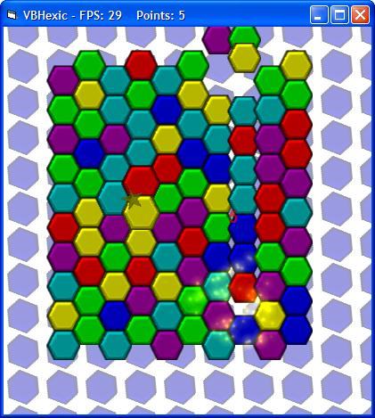



## A Hexic Clone \- VBHexic

### Description

VBHexic is a hexic clone game I never quite completed. It includes a particle engine and scoring system, along with combinations of all types except for stars. Although it is unfinished, the framework is very sturdy and powerful. Wouldn't take a whole lot to finish this bad boy up. :) Update July 9: Added support for stars, point multipliers, better effects, and some other goodies. Still a pretty dead project, though... I was just bored one night and decided to give it a little work. ;)
 
### More Info
 

             |
---                |---
**Submitted On**   |2007-07-09 14:16:40
**By**             |[Spodii](https://github.com/Planet-Source-Code/PSCIndex/blob/master/ByAuthor/spodii.md)
**Level**          |Advanced
**User Rating**    |4.5 (49 globes from 11 users)
**Compatibility**  |VB 5\.0, VB 6\.0
**Category**       |[Graphics](https://github.com/Planet-Source-Code/PSCIndex/blob/master/ByCategory/graphics__1-46.md)
**World**          |[Visual Basic](https://github.com/Planet-Source-Code/PSCIndex/blob/master/ByWorld/visual-basic.md)
**Archive File**   |[A\_Hexic\_Cl207468792007\.zip](https://github.com/Planet-Source-Code/spodii-a-hexic-clone-vbhexic__1-66534/archive/master.zip)

